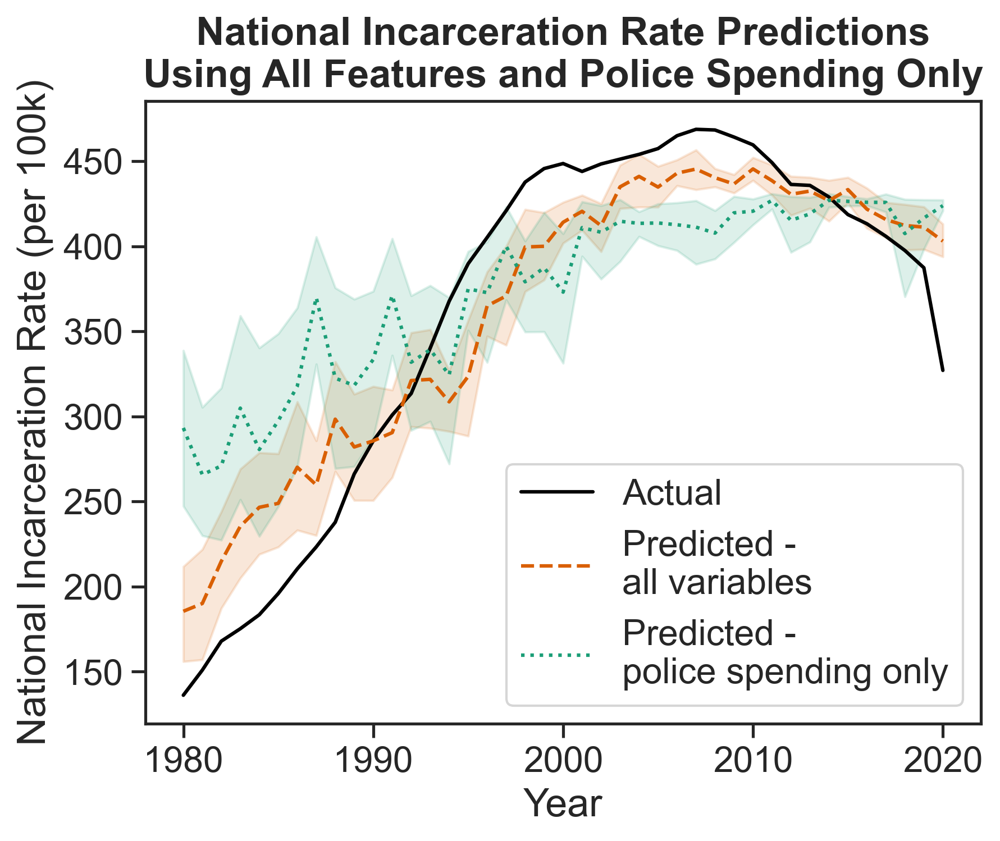

## The one-liner

> I integrated **5 data sources on crime, incarceration, poverty, race, and police spending** into **one dataset spanning 40 years, with entries for all 50 states**, in order to **assess the predictive power of crime rates, poverty rates, and racial diversity relative to incarceration rates across the United States and over time**.

**Role:** I worked solo to independently build this project
**Team:** solo
**Repo:** [github.com/eskerani/prison-predictor-capstone](https://github.com/eskerani/prison-predictor-capstone)

## The question

Since the 1980s the United States' incarceration rate has skyrocketed; currently the US imprisons its citizens at one of the highest rates in the world. However, violent crime rates have been steadily falling since peaking in the 1990s. Given that the US's criminal legal system wields tremendous power - power that is most often turned against already-disadvantaged individuals and their communities - it is important that we recognize protective and risk factors for incarceration, many of which are social in nature.

## The data

This project combines data from five sources, all of which are at the state level and contain information for the years 1980-2020:

* Data about the incarcerated population of each state (excluding federal prisoners) was obtained from the Bureau of Justice Statistics' Corrections Statistical Analysis Tool
* Crime data was downloaded from the FBI's Summary Reporting System (SRS)
* Data on police spending was collected by the Census Bureau and made available for download by the Urban Institute's State and Local Finance Data tool 
* Poverty data was collected by the Census Bureau and included the population of each state
* Race data was estimated based on demographic information included in the IPUMS Current Population Survey (CPS)

Given the historical nature of this project, all data sets were ingested as one-time .csv or .xlsx downloads. Once downloaded, the datasets were individually cleaned and wrangled into a standardized format. The IPUMS data was aggregated up to the state and year level, at which point the datasets could be joined together using state and year as the key. Using these combined data, all features were standardized by population (per 100k) based on the population estimates originally included in the poverty dataset. **The resulting combined dataset contained 2,050 rows and 10 columns: state, year, total population, incarceration rate, total crime rate, violent crime rate, property crime rate, poverty rate, the rate of non-white residents, and police spending rate.** There were certainly some stumbling blocks along the way, especially because each data set came with its own caveats and quality issues that had to be resolved before the join could be carried out.

## The approach

This project uses support vector regression (SVR), chosen because of its ability to deal with complex, non-linear data while remaining more straightforward than methods such as XGBoost. Five single-variable models were trained, each using data from only one predictive factor to ensure that no other data affected predictions; in addition, one model was trained using all predictive factors as inputs in order to evaluate the importance of each factor when combined.

Three main evaluation metrics are used: correlation coefficient, r2 score, and root mean squared error (RMSE). Additionally, permutation importance and SHAP values are used to determine the most influential feature of the final multi-variate model. Definitions of all metrics can be found in the writeup. 

## Findings

{Line plot displaying model predictions of the national incarceration rate over time using only police spending (in dotted green) and all features (in dashed orange) as inputs.}

Across the single-feature models, though none performed very well, police spending served as the best isolated predictor of national incarceration rates with an R2 of 0.3 and an RMSE of 89.01. Police spending was also the most important feature in the combined model; its permutation feature importance was 0.18 and its SHAP value was 0.2. The combined model performed markedly better than any of the individual models (R2 = 0.74, RMSE = 53.65), indicating that accounting for more variables gives the model a much fuller picture of the factors that influence incarceration rates.

It must be noted that all data were based on survey estimates, and that to some extent these factors are inherently interrelated. 

## The full write-up

The full write-up can be found [here](projects/capstone/writeup.pdf)

## Dig deeper

- 📦 **Code & pipeline:** [prison-predictor-capstone](https://github.com/eskerani/prison-predictor-capstone)
- 📊 **Poster:** [final poster]()
